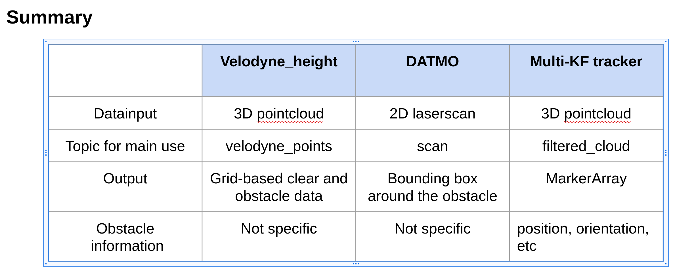

# object_detection_cs169

This is a git repository for object_detection_cs169 for CS 69 / 169 class at Dartmouth Robotics perception course.
Works are coded by Mingi Jeong, 1st year Ph.D. Students in Robotics/Computer Science at Dartmouth.
This program was conducted on ROS kinetic and Linux Ubuntu 16.04.

I am pleased to take this class taught by Prof.Alberto Quattrini Li.

# How to download and install necessary packages
1. Clone essential packages in your workspace folder.
  1) multi kf tracker package : https://github.com/praveen-palanisamy/multiple-object-tracking-lidar.git
  2) DATMO : https://github.com/kostaskonkk/datmo.git
  3) velodyne_height_map : https://github.com/jack-oquin/velodyne_height_map
     (see the reference: https://wiki.ros.org/velodyne_height_map)
2. Clone this repository in your workspace folder\
    https://github.com/MingiJeong/object_detection_cs169.git

3. Download bag files from my google drive\
    https://drive.google.com/drive/folders/1P5PHPqsVY72NdL-bud0JuwGFvaM6uBuo?usp=sharing

4. catkin_make and source bashfile.

The comparison of imported methods is given as the following table.

# In case of logging with Velodyne LiDAR
If you are using Velodyne VLP-16 LiDAR for logging at first, do the followings.
1. Make sure you have LiDAR's necessary package and driver as per the following links.\
    http://wiki.ros.org/velodyne_driver \
    http://wiki.ros.org/velodyne/Tutorials/Getting%20Started%20with%20the%20Velodyne%20VLP16

2. Set up the environment while you get connected with LiDAR.

3. Once ready, roslaunch object_detection_cs169 obstacle_detection.launch

4. After logging finishes, terminate the launchfile.

# In case of use after logging is finished
If you want to use the saved rosbag file (baesd on the my bag file in google drive), do the followings.
The video of sample executions are
 - DATMO: https://drive.google.com/file/d/1oG2EqW_aWHpQ7NI8vvt60l0XP8W8V-f8/view?usp=sharing
 - velodyne_height_map: https://drive.google.com/file/d/1lWAma1t1XdN2SpFjz0dANO0axM3GJ0DL/view?usp=sharing
 - multi kf: https://drive.google.com/file/d/1mdefRbLgPuZ7ZePZOPm-MqUxWEz3ng4c/view?usp=sharing

1. Make the python scripts executable\
    chmod +x Yourworkspace/object_detection_cs169/scan_to_point_cloud.py\
    chmod +x Yourworkspace/object_detection_cs169/obstacle_detection_multi.py\
    chmod +x Yourworkspace/object_detection_cs169/obstacle_detection_directuse_3D.py\
    chmod +x Yourworkspace/object_detection_cs169/plotter.py

2. In the launch file "obstacle_detection.launch",
 - Set up the rosbag file number and directory for rosbag play node.
 - Depending on the mode you want, please make the default value as true and the rest of them as false.\
   For example, if I want to use DATMO method, I changed the last one as true.\
      - arg name="use_datmo" default="true"\
      - arg name="use_velodyne_height" default="false"\
      - arg name="use_multi" default="false"
3. roslaunch obstacle_detection_cs169 obstacle_analysis.launch
  - In case you use multi kf method, please set up in the saving folder and variable in "obstacle_detection_multi.py" line 19-32, line 141-143.
  - Given that multi kf method detected the obstacle in a different ID in each case, change the ID number accordingly in line 113.
      - for case 1 it is number 2 or 4 (dark skyblue first and green): not used for algorithm's poor performance
      - for case 2 it is number 0 (black)
      - for case 3 it is number 4 (green)
      - for case 4 it is number 2 (dark sky blue)
4. You will see Rviz visualization immediately.
5. In case of multi kf, you can analyze the data and potential collision cases as per CPA threshold you set in "obstacle_detection.launch". \
For plotting the data, do python Yourworkspace/src/object_detection_cs169/scripts/plotter.py
   - You need to change the csv path and save path accordingly in the plotter.py
6. You are good to go!

# References
[1] https://doi.org/10.5281/zenodo.3559186 \
[2] http://resolver.tudelft.nl/uuid:103fe186-925e-46f7-8275-d746e7c47600 \
[3] https://wiki.ros.org/catkin/Tutorials/create_a_workspace
